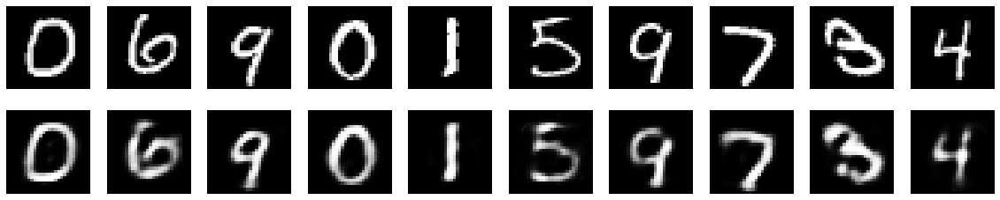

# Autoencoders_basics
source - https://blog.keras.io/building-autoencoders-in-keras.html
# Autoencoder using simple neural networks
Autoencoderssimple.py contains a program to build a simple autoencoder using two dense layers, one of which(encoder) takes input an image 
and returns a layer with fewer dimensions (32), while the other(decoder) takes input this reduced version and outputs a layer of the same 
size as of the input.

### This architecture of the simple neuron is as described in the image below - 
#### the input and output layers have 784 units(28*28), while the encoding layers have 32 units.
(image linke - https://static.packt-cdn.com/products/9781789138900/graphics/afb219b7-96dc-470a-ab89-f49eadb8fd5b.png)

### Upon training the model, we can get decoded images for the images in the test data
### since the model is trained on mnist dataset, it will work on data similar to mnist. 
#### the first row includes the test images, while the images below it shows the final images given after encoding-decoding.

