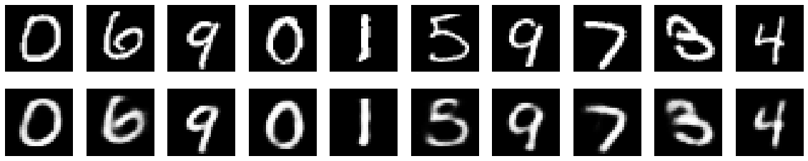

# Autoencoders_basics
source - https://blog.keras.io/building-autoencoders-in-keras.html
# Autoencoder using simple neural networks
https://github.com/hardikkamboj/Autoencoders_basics/blob/master/autoencoders_simple.py
Autoencoderssimple.py contains a program to build a simple autoencoder using two dense layers, one of which(encoder) takes input an image 
and returns a layer with fewer dimensions (32), while the other(decoder) takes input this reduced version and outputs a layer of the same 
size as of the input.

### This architecture of the simple neuron is as described in the image below - 
#### the input and output layers have 784 units(28*28), while the encoding layers have 32 units.
(image link - https://static.packt-cdn.com/products/9781789138900/graphics/afb219b7-96dc-470a-ab89-f49eadb8fd5b.png)

### Upon training the model, we can get decoded images for the images in the test data
### since the model is trained on mnist dataset, it will work on data similar to mnist. 
#### the first row includes the test images, while the images below it shows the final images given after encoding-decoding.

# Autoencoder using deep neural networks 
https://github.com/hardikkamboj/Autoencoders_basics/blob/master/autoencoders_deep_neural_networks.py
Next we build another program, which takes input and gives output like the previous model, the only differnce is that instead of having
one leayer each for both encoders and decoders, the layers are increased to three layers each for encoder and decoder.

The image architecture is similar to - 
(image link - https://static.packt-cdn.com/products/9781787121089/graphics/B12043_04_06.png)

Training with this model for 100 epochs we have loss of 0.096 (which is better than our previous model)
Also, we can see the changes in the decoded images

